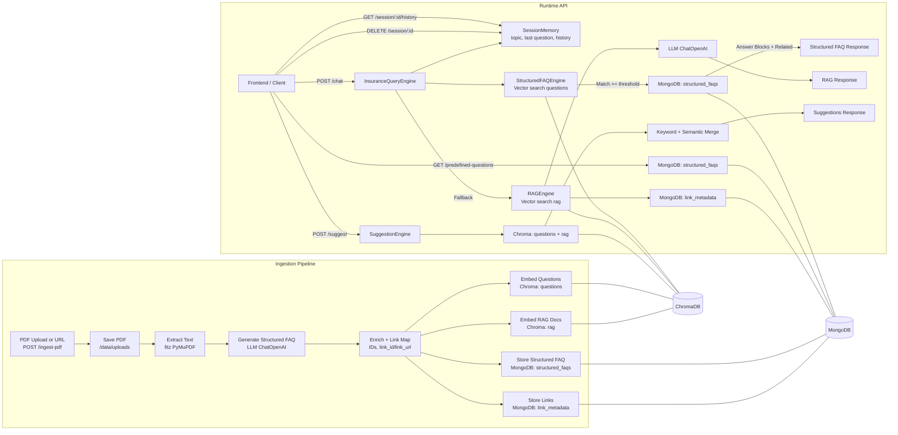

# FAQ Workflow Diagram

Notes:
- Structured FAQ path is preferred; RAG is used only if no strong FAQ match is found.
- Suggestions use both question and RAG vector stores, then merge keyword + semantic hits.
